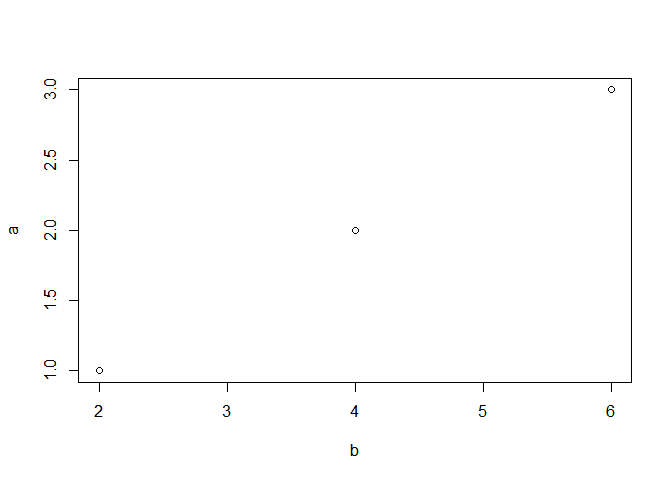

Example R Script
================
John Smith
Jan 1st, 2020

``` r
a=c(1,2,3)
b=a*2
plot(b,a)
```

<!-- -->

``` r
c=a*b
```

A script comment that includes **markdown** formatting. This is an
equation *A* = *π* \* *r*<sup>2</sup>
